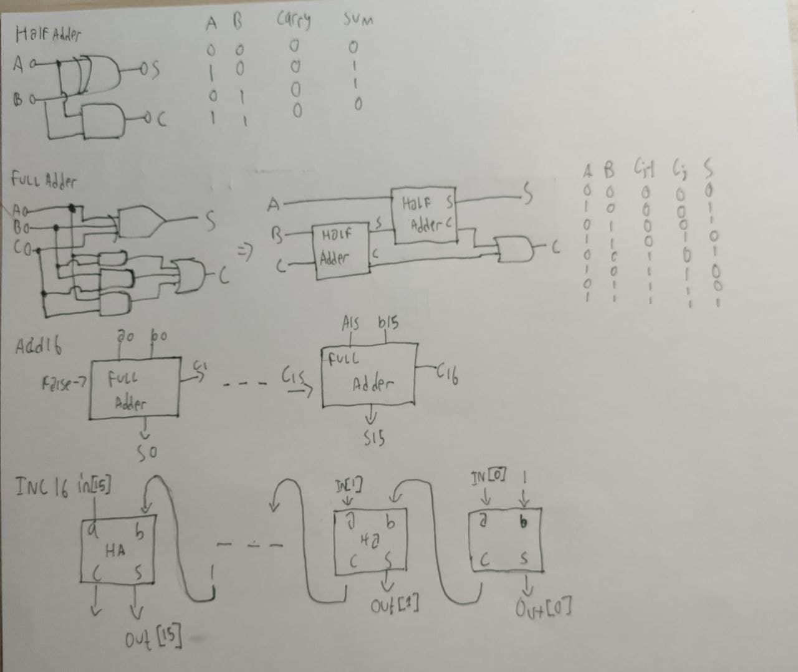

## A. HalfAdder
```
// This file is part of www.nand2tetris.org
// and the book "The Elements of Computing Systems"
// by Nisan and Schocken, MIT Press.
// File name: projects/02/HalfAdder.hdl

/**
 * Computes the sum of two bits.
 */

CHIP HalfAdder {
    IN a, b;    // 1-bit inputs
    OUT sum,    // Right bit of a + b 
        carry;  // Left bit of a + b

    PARTS:
    // Put you code here:
    Xor(a=a, b=b, out=sum);
    And(a=a, b=b, out=carry);
}
```

## B. FullAdder
```
// This file is part of www.nand2tetris.org
// and the book "The Elements of Computing Systems"
// by Nisan and Schocken, MIT Press.
// File name: projects/02/FullAdder.hdl

/**
 * Computes the sum of three bits.
 */

CHIP FullAdder {
    IN a, b, c;  // 1-bit inputs
    OUT sum,     // Right bit of a + b + c
        carry;   // Left bit of a + b + c

    PARTS:
    // Put you code here:
    Xor(a=a, b=b, out=d);
    Xor(a=c, b=d, out=sum);

    And(a=a, b=b, out=ab);
    And(a=a, b=c, out=ac);
    And(a=b, b=c, out=bc);

    Or(a=ab, b=ac, out= abac);
    Or(a=abac, b=bc, out=carry);

}
```

## C. Adder16

```
// This file is part of www.nand2tetris.org
// and the book "The Elements of Computing Systems"
// by Nisan and Schocken, MIT Press.
// File name: projects/02/Adder16.hdl

/**
 * Adds two 16-bit values.
 * The most significant carry bit is ignored.
 */

CHIP Add16 {
    IN a[16], b[16];
    OUT out[16];

    PARTS:
   // Put you code here:
   FullAdder(a=a[0], b=b[0], carry=c1, sum=out[0]);
   FullAdder(a=a[1], b=b[1], c=c1, carry=c2, sum=out[1]);
   FullAdder(a=a[2], b=b[2], c=c2, carry=c3, sum=out[2]);
   FullAdder(a=a[3], b=b[3], c=c3, carry=c4, sum=out[3]);
   FullAdder(a=a[4], b=b[4], c=c4, carry=c5, sum=out[4]);
   FullAdder(a=a[5], b=b[5], c=c5, carry=c6, sum=out[5]);
   FullAdder(a=a[6], b=b[6], c=c6, carry=c7, sum=out[6]);
   FullAdder(a=a[7], b=b[7], c=c7, carry=c8, sum=out[7]);
   FullAdder(a=a[8], b=b[8], c=c8, carry=c9, sum=out[8]);
   FullAdder(a=a[9], b=b[9], c=c9, carry=c10, sum=out[9]);
   FullAdder(a=a[10], b=b[10], c=c10, carry=c11, sum=out[10]);
   FullAdder(a=a[11], b=b[11], c=c11, carry=c12, sum=out[11]);
   FullAdder(a=a[12], b=b[12], c=c12, carry=c13, sum=out[12]);
   FullAdder(a=a[13], b=b[13], c=c13, carry=c14, sum=out[13]);
   FullAdder(a=a[14], b=b[14], c=c14, carry=c15, sum=out[14]);
   FullAdder(a=a[15], b=b[15], c=c15, sum=out[15]);
}
```

## D. Inc16

```
// This file is part of www.nand2tetris.org
// and the book "The Elements of Computing Systems"
// by Nisan and Schocken, MIT Press.
// File name: projects/02/Inc16.hdl

/**
 * 16-bit incrementer:
 * out = in + 1 (arithmetic addition)
 */

CHIP Inc16 {
    IN in[16];
    OUT out[16];

    PARTS:
   // Put you code here:
   Add16(a=in, b[0]=true, b[1..15]=false, out=out);
}
```
