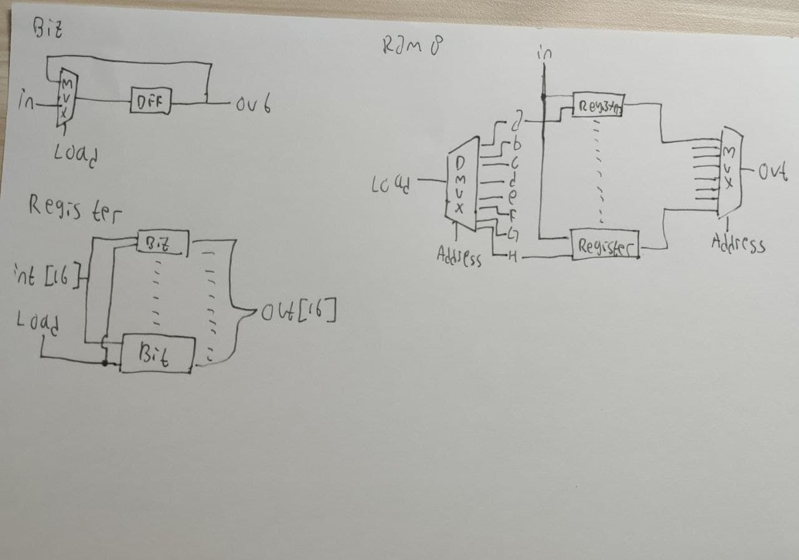

## A. BIT
```
// This file is part of www.nand2tetris.org
// and the book "The Elements of Computing Systems"
// by Nisan and Schocken, MIT Press.
// File name: projects/03/a/Bit.hdl

/**
 * 1-bit register:
 * If load[t] == 1 then out[t+1] = in[t]
 *                 else out does not change (out[t+1] = out[t])
 */

CHIP Bit {
    IN in, load;
    OUT out;

    PARTS:
    // Put your code here:
    DFF(in=y, out=x, out=out);
    Mux(a=x, b=in, sel=load, out=y);
}
```

## B. REGISTER
```
// This file is part of www.nand2tetris.org
// and the book "The Elements of Computing Systems"
// by Nisan and Schocken, MIT Press.
// File name: projects/03/a/Register.hdl

/**
 * 16-bit register:
 * If load[t] == 1 then out[t+1] = in[t]
 * else out does not change
 */

CHIP Register {
    IN in[16], load;
    OUT out[16];

    PARTS:
    // Put your code here:
    Bit(in=in[0], load=load, out=out[0]);
    Bit(in=in[1], load=load, out=out[1]);
    Bit(in=in[2], load=load, out=out[2]);
    Bit(in=in[3], load=load, out=out[3]);
    Bit(in=in[4], load=load, out=out[4]);
    Bit(in=in[5], load=load, out=out[5]);
    Bit(in=in[6], load=load, out=out[6]);
    Bit(in=in[7], load=load, out=out[7]);
    Bit(in=in[8], load=load, out=out[8]);
    Bit(in=in[9], load=load, out=out[9]);
    Bit(in=in[10], load=load, out=out[10]);
    Bit(in=in[11], load=load, out=out[11]);
    Bit(in=in[12], load=load, out=out[12]);
    Bit(in=in[13], load=load, out=out[13]);
    Bit(in=in[14], load=load, out=out[14]);
    Bit(in=in[15], load=load, out=out[15]);
}
```

## C. RAM8

```
// This file is part of www.nand2tetris.org
// and the book "The Elements of Computing Systems"
// by Nisan and Schocken, MIT Press.
// File name: projects/03/a/RAM8.hdl

/**
 * Memory of 8 registers, each 16 bit-wide. Out holds the value
 * stored at the memory location specified by address. If load==1, then 
 * the in value is loaded into the memory location specified by address 
 * (the loaded value will be emitted to out from the next time step onward).
 */

CHIP RAM8 {
    IN in[16], load, address[3];
    OUT out[16];

    PARTS:
    // Put your code here:
    DMux8Way(in=load,sel=address,a=a,b=b,c=c,d=d,e=e,f=f,g=g,h=h);
    Register(in=in,load=a,out=oa);
    Register(in=in,load=b,out=ob);
    Register(in=in,load=c,out=oc);
    Register(in=in,load=d,out=od);
    Register(in=in,load=e,out=oe);
    Register(in=in,load=f,out=of);
    Register(in=in,load=g,out=og);
    Register(in=in,load=h,out=oh);
    Mux8Way16(a=oa,b=ob,c=oc,d=od,e=oe,f=of,g=og,h=oh,sel=address,out=out);
}
```

