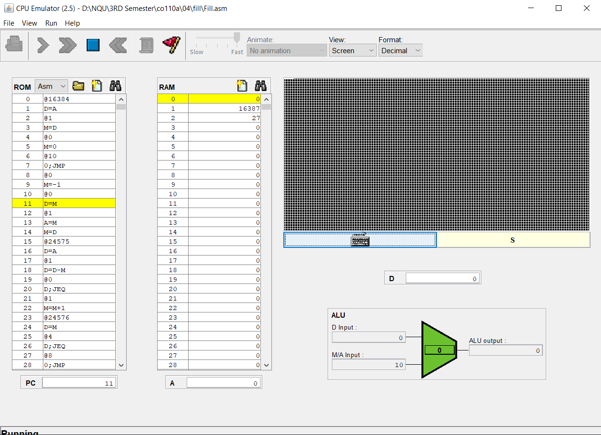

## A. FILL


### A.1 FILL Code
```
// This file is part of www.nand2tetris.org
// and the book "The Elements of Computing Systems"
// by Nisan and Schocken, MIT Press.
// File name: projects/04/Fill.asm

// Runs an infinite loop that listens to the keyboard input.
// When a key is pressed (any key), the program blackens the screen,
// i.e. writes "black" in every pixel;
// the screen should remain fully black as long as the key is pressed. 
// When no key is pressed, the program clears the screen, i.e. writes
// "white" in every pixel;
// the screen should remain fully clear as long as no key is pressed.

// Put your code here.

@16384    
D=A
@1
M=D

@0       
M=0
@10
0;JMP     

@0        
M=-1

@0        
D=M
@1        
A=M
M=D       

@24575    
D=A
@1
D=D-M
@0        
D;JEQ

@1        
M=M+1

@24576    
D=M
@4
D;JEQ
@8        
0;JMP
```

## A. MULT


### A.1 MULT Code
```
// This file is part of www.nand2tetris.org
// and the book "The Elements of Computing Systems"
// by Nisan and Schocken, MIT Press.
// File name: projects/04/Mult.asm

// Multiplies R0 and R1 and stores the result in R2.
// (R0, R1, R2 refer to RAM[0], RAM[1], and RAM[2], respectively.)

// Put your code here.
0. @10     
1. D=A     
2. @0      
3. M=D     

4. @2      
5. D=A     
6. @1      
7. M=D     

8. @12
9. M=D

10. @0
11. D=M

12. @2
13. M=D+M

14. @12
15. M=M-1
16. M;JNE  

@17     
0;JMP
```
