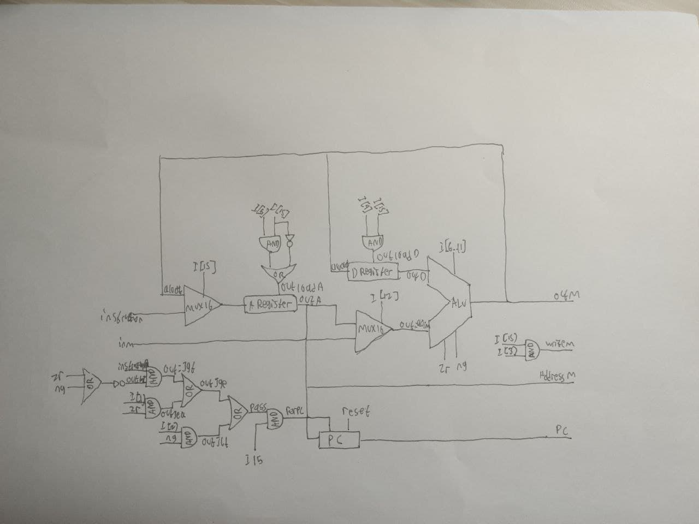

## A. CPU


```
// This file is part of www.nand2tetris.org
// and the book "The Elements of Computing Systems"
// by Nisan and Schocken, MIT Press.
// File name: projects/05/CPU.hdl

/**
 * The Hack CPU (Central Processing unit), consisting of an ALU,
 * two registers named A and D, and a program counter named PC.
 * The CPU is designed to fetch and execute instructions written in 
 * the Hack machine language. In particular, functions as follows:
 * Executes the inputted instruction according to the Hack machine 
 * language specification. The D and A in the language specification
 * refer to CPU-resident registers, while M refers to the external
 * memory location addressed by A, i.e. to Memory[A]. The inM input 
 * holds the value of this location. If the current instruction needs 
 * to write a value to M, the value is placed in outM, the address 
 * of the target location is placed in the addressM output, and the 
 * writeM control bit is asserted. (When writeM==0, any value may 
 * appear in outM). The outM and writeM outputs are combinational: 
 * they are affected instantaneously by the execution of the current 
 * instruction. The addressM and pc outputs are clocked: although they 
 * are affected by the execution of the current instruction, they commit 
 * to their new values only in the next time step. If reset==1 then the 
 * CPU jumps to address 0 (i.e. pc is set to 0 in next time step) rather 
 * than to the address resulting from executing the current instruction. 
 */

CHIP CPU {

    IN  inM[16],         // M value input  (M = contents of RAM[A])
        instruction[16], // Instruction for execution
        reset;           // Signals whether to re-start the current
                         // program (reset==1) or continue executing
                         // the current program (reset==0).

    OUT outM[16],        // M value output
        writeM,          // Write to M? 
        addressM[15],    // Address in data memory (of M)
        pc[15];          // address of next instruction

    PARTS:
    // Put your code here:
    //to read if the input is A (the address of memory (0XXXXXXXXXXXXXXX)) or an C-instruction (111XXXXXXXXXXXXX)
    //                                                  ^ instruction[15] == 0, is A            ^ instruction[15] == 1, is C
    Mux16(a=instruction, b=aluOut, sel=instruction[15], out=CorA);

    //load for A register
    //if is A, loadA = 1
    //else if is C AND instruction[5] == 1, loadA = 1
    And(a=instruction[5], b=instruction[15], out=Cd1);
    Not(in=instruction[15], out=NC);
    Or(a=NC, b=Cd1, out=loadA);

    //save the address value in ARegister
    ARegister(in=CorA, load=loadA, out=A, out[0..14]=addressM);
    //instruction[12] = a
    // if a=1, read A (ARegister).
    // else if a=0, read M (RAM[A]).
    Mux16(a=A, b=inM, sel=instruction[12], out=AorM);

    //load for D register
    //if is C-Instruction AND d2 == 1, loadD = 1
    And(a=instruction[15], b=instruction[4], out=loadD);
    DRegister(in=aluOut, load=loadD, out=D);

    //do operation between (D and A) or (D and M)
    ALU(x=D, y=AorM, zx=instruction[11], nx=instruction[10], zy=instruction[9], ny=instruction[8], f=instruction[7], no=instruction[6], out=outM, out=aluOut, zr=zr, ng=ng);

    //if is A AND d3 == 1, writeM = 1
    And(a=instruction[15], b=instruction[3], out=writeM);

    //start jump and reset section
    Or(a=zr, b=ng, out=ZRorNG); //is input zero or negative
    Not(in=ZRorNG, out=GT); //input is not zero and negative (greater than)
    //(Jump Condition)
    And(a=GT, b=instruction[0], out=JGT);
    And(a=zr, b=instruction[1], out=JEQ);
    Or(a=JEQ, b=JGT, out=JGE);
    And(a=ng, b=instruction[2], out=JLT);
    Or(a=JLT, b=JGE, out=Pass);
    And(a=instruction[15], b=Pass, out=forPC);
    //if the input fulfill one of the condition above, do JUMP function

    PC(in=A, load=forPC, inc=true, reset=reset, out[0..14]=pc);
}
```