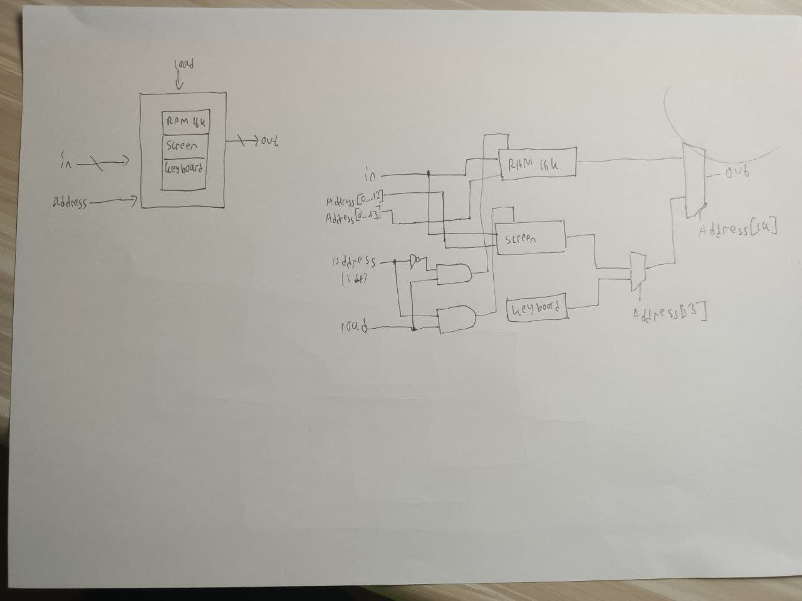
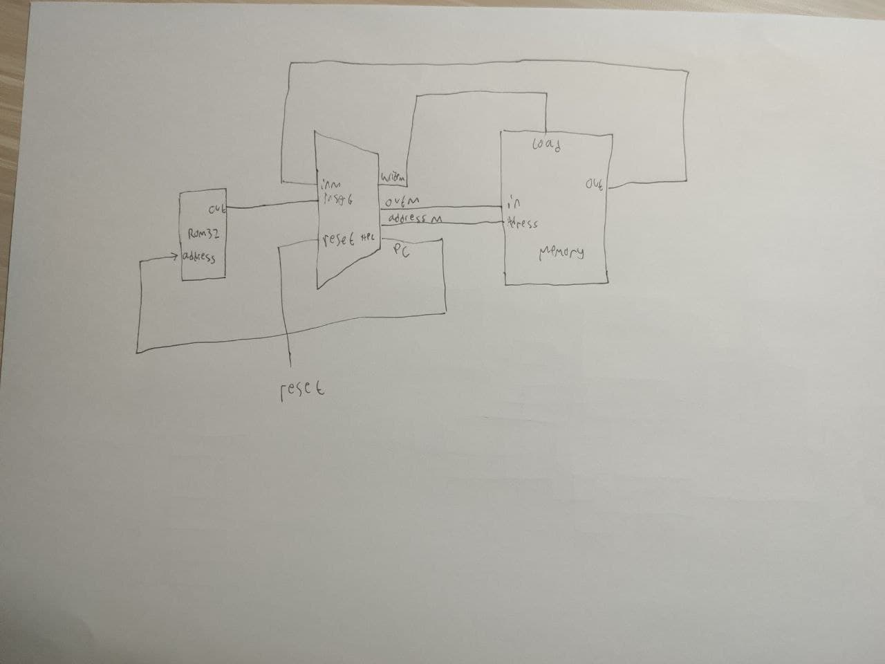

## A. MEMORY


### A.1 MEMORY Code
```
// This file is part of www.nand2tetris.org
// and the book "The Elements of Computing Systems"
// by Nisan and Schocken, MIT Press.
// File name: projects/05/Memory.hdl

/**
 * The complete address space of the Hack computer's memory,
 * including RAM and memory-mapped I/O. 
 * The chip facilitates read and write operations, as follows:
 *     Read:  out(t) = Memory[address(t)](t)
 *     Write: if load(t-1) then Memory[address(t-1)](t) = in(t-1)
 * In words: the chip always outputs the value stored at the memory 
 * location specified by address. If load==1, the in value is loaded 
 * into the memory location specified by address. This value becomes 
 * available through the out output from the next time step onward.
 * Address space rules:
 * Only the upper 16K+8K+1 words of the Memory chip are used. 
 * Access to address>0x6000 is invalid. Access to any address in 
 * the range 0x4000-0x5FFF results in accessing the screen memory 
 * map. Access to address 0x6000 results in accessing the keyboard 
 * memory map. The behavior in these addresses is described in the 
 * Screen and Keyboard chip specifications given in the book.
 */

CHIP Memory {
    IN in[16], load, address[15];
    OUT out[16];

    PARTS:
    // Put your code here:
    Not(in=address[14],out=Nad);
    And(a=address[14],b=load,out=Sload);
    And(a=Nad,b=load,out=Rload);

    RAM16K(in=in,address=address[0..13],load=Rload,out=R);
    Screen(in=in,address=address[0..12],load=Sload,out=S);
    Keyboard(out=kout);

    Mux16(a=S,b=kout,sel=address[13],out=outSk);
    Mux16(a=R,b=outSk,sel=address[14],out=out);
}
```

## A. COMPUTER


### A.1 COPUTER Code
```
// This file is part of www.nand2tetris.org
// and the book "The Elements of Computing Systems"
// by Nisan and Schocken, MIT Press.
// File name: projects/05/Computer.hdl

/**
 * The HACK computer, including CPU, ROM and RAM.
 * When reset is 0, the program stored in the computer's ROM executes.
 * When reset is 1, the execution of the program restarts. 
 * Thus, to start a program's execution, reset must be pushed "up" (1)
 * and "down" (0). From this point onward the user is at the mercy of 
 * the software. In particular, depending on the program's code, the 
 * screen may show some output and the user may be able to interact 
 * with the computer via the keyboard.
 */

CHIP Computer {

    IN reset;

    PARTS:
    // Put your code here:
    ROM32K(address=pc,out=instruction);
    CPU(inM=inM,instruction=instruction,reset=reset,writeM=writeM,outM=outM,addressM=addressM,pc=pc);
    Memory(in=outM,address=addressM,load=writeM,out=inM);
}
```
